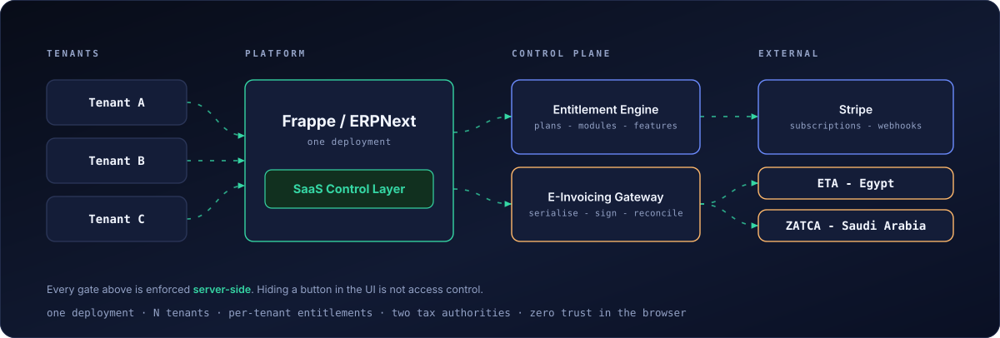

<picture>
  <source media="(prefers-color-scheme: dark)" srcset="./assets/hero-dark.svg">
  <source media="(prefers-color-scheme: light)" srcset="./assets/hero-light.svg">
  
</picture>

  
  
  
  

  

---

## `whoami`

I build **multi-tenant SaaS platforms** and **tax-authority e-invoicing systems** in Python on the
Frappe Framework — the kind of backend work where a rounding error becomes a compliance problem and
a missing permission check becomes a data leak.

Three years in, my work has mostly lived in two hard places:

- **Turning ERPNext into a sellable product.** A `Plans › Modules › Features` entitlement engine with
  Stripe billing, trial lifecycles and **server-side** enforcement — because hiding a button in the UI
  is not access control.
- **Talking to governments.** Signed electronic invoices submitted to the Egyptian **ETA** and Saudi
  **ZATCA** portals, with serialisation, digital signing and submission-status reconciliation that has
  to survive a tax audit.

BSc in Computers &amp; Artificial Intelligence, Helwan University. Arabic native, English B2.

 

## The system I keep building

<picture>
  <source media="(prefers-color-scheme: dark)" srcset="./assets/architecture-dark.svg">
  <source media="(prefers-color-scheme: light)" srcset="./assets/architecture-light.svg">
  
</picture>

 

## Featured work

> Much of the work below ships inside client and employer repositories. Where the code is private,
> the write-up is the artefact — architecture and trade-offs, not screenshots.

<table>
<tr>
<td width="50%" valign="top">

### 🧩 Uonyx SaaS Control Layer
`Frappe` · `Python` · `Stripe` · `MariaDB`

A Frappe app that converts a standard ERPNext deployment into a commercial multi-tenant SaaS product.

- Entitlement model mapping **plans → modules → features**, enforced server-side: module permissions,
  feature gating, licensed-user limits, DocType customisations
- Stripe end-to-end — provisioning, webhooks, daily sync, upgrade/downgrade detection, renewal and
  grace-period automation
- Self-service trial lifecycle: auto-provisioning, in-app expiry banners, grace period, full lockout
  with a guided subscribe path
- Rebuilt the desk experience across **~7,500 lines** of custom JS/CSS, backed by unit tests and
  GitHub Actions CI

</td>
<td width="50%" valign="top">

### 🧾 E-Invoicing Compliance — Egypt &amp; Saudi Arabia
`Frappe` · `ERPNext POS` · `REST` · `Digital signing`

Tax-authority integrations for **two regulated markets**, in production.

- Egyptian Tax Authority e-invoice **and** e-receipt submission
- Saudi ZATCA POS invoicing
- Document serialisation, signature handling, and submission-status reconciliation against the
  government portals
- Built to fail loudly and reconcile cleanly — the failure mode here is a fine, not a 500

</td>
</tr>
<tr>
<td width="50%" valign="top">

### 🤝 Charity Management Platform
`React` · `Frappe` · `REST API`

Full-stack platform replacing spreadsheet-based tracking for a charitable foundation.

- React SPA over a Frappe/Python API, token auth, role-scoped data access
- Charity domain modelled as custom DocTypes with workflows and approval routing
- Responsive **Arabic / RTL** interface built for non-technical staff

</td>
<td width="50%" valign="top">

### 🧠 ML Social Platform — Graduation Project
`Flutter` · `Machine Learning` &nbsp;·&nbsp; **Grade: Excellent**

Social app using ML to moderate and understand its own content.

- Auto-moderation of negative comments
- Content translation
- Post sentiment classification

</td>
</tr>
</table>

 

## Public code

The repositories below are mine and open — smaller than the client work above, but you can read every
line of them.

| Repository | What it is |
|---|---|
| [**modern_desk_theme**](https://github.com/leomedo/modern_desk_theme) | A Frappe app that restyles the ERPNext desk. Python · CSS · JS, with pre-commit and CI wired up. |
| [**DevOps_files**](https://github.com/leomedo/DevOps_files) | The infrastructure I actually run: Kubernetes manifests, Docker images, Grafana, MinIO, nginx-proxy-manager, and a local ZATCA signing image. |
| [**fastapi_crud**](https://github.com/leomedo/fastapi_crud) | A FastAPI service with Redis caching, Firebase auth, templated views and centralised exception handling. |
| [**forSocialApp**](https://github.com/leomedo/forSocialApp) | The ML behind my graduation project — toxic-comment detection, sentiment training and language detection. |
| [**auth-mobile-app**](https://github.com/leomedo/auth-mobile-app) | Flutter authentication app, built during the Intern2Grow mobile internship. |
| [**quote-generator-mobile-app**](https://github.com/leomedo/quote-generator-mobile-app) | Flutter quote generator, the second Intern2Grow deliverable. |

 

## Stack

<table>
<tr><td><b>Backend</b></td><td>

</td></tr>

<tr><td><b>SaaS&nbsp;&amp;&nbsp;Arch</b></td><td>

</td></tr>

<tr><td><b>Frontend</b></td><td>

</td></tr>

<tr><td><b>Data</b></td><td>

</td></tr>

<tr><td><b>DevOps</b></td><td>

</td></tr>

<tr><td><b>ML</b></td><td>

</td></tr>
</table>

 

## Experience

| | Role | Focus |
|---|---|---|
| **Dynamic** | Software Engineer — Backend / Python | Main contributor to the company's multi-tenant SaaS platform and core ERPNext layer. Contract management, ETA &amp; ZATCA e-invoicing, a TypeScript desk theme, HR &amp; attendance, fleet · real-estate · delivery modules, payment and e-commerce integrations, real-time Supervisor socket integration |
| **Uonyx** | Backend Engineer — SaaS Platform | SaaS Control Layer, Stripe lifecycle, entitlement enforcement, role-driven executive KPI dashboards |
| **Loctech** | Full-Stack Developer — Freelance | React + Frappe charity platform, RTL UI, role-scoped REST APIs |
| **Prosoft** | Software Engineer — Python / ERPNext | Module customisation, custom themes, workflow automation |
| **Appy Innovate** | Software Engineer — Python / Frappe | ERPNext extensions for multiple clients, third-party API integration, query optimisation |

 

## How I work

- **Enforce on the server.** Permissions, entitlements and limits belong in the backend. If the only
  thing stopping a user is a hidden button, it isn't stopping them.
- **Design for the audit.** Compliance integrations get built assuming someone will one day ask for
  proof of every submission — so reconciliation is a feature, not an afterthought.
- **Optimise the query before the cache.** Caching a slow report hides the problem; the dashboards
  I build are fast because the queries are, not because the answers are stale.
- **Ship in Arabic too.** RTL and non-technical users are requirements, not polish.

 

## A year of commits

<picture>
  <source media="(prefers-color-scheme: dark)" srcset="https://raw.githubusercontent.com/leomedo/leomedo/output/snake-dark.svg">
  <source media="(prefers-color-scheme: light)" srcset="https://raw.githubusercontent.com/leomedo/leomedo/output/snake-light.svg">
  
</picture>

Redrawn daily by <a href="./.github/workflows/snake.yml">a GitHub Action</a>, in the same palette as the banner above. Most of those commits land in private client repositories — the shape is public, the code isn't.

 

---

<h3 align="center">Looking for someone to own your backend?</h3>

  I'm open to <b>remote</b>, <b>hybrid</b> and <b>contract</b> work — especially anything involving
   Frappe/ERPNext, multi-tenant SaaS, billing systems, or regulated integrations.

  
  

Giza, Egypt · Arabic (native) · English (B2) · French (A1)

